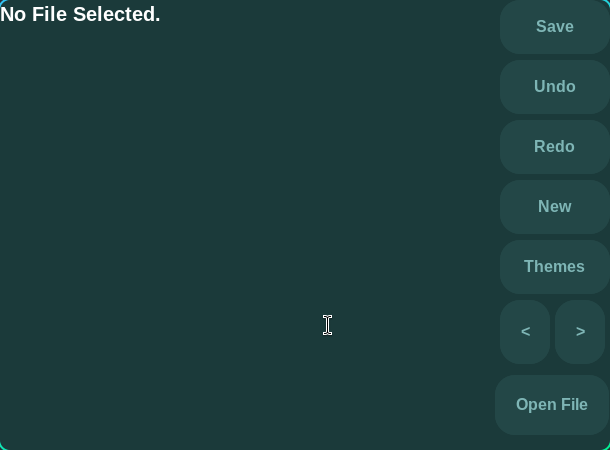
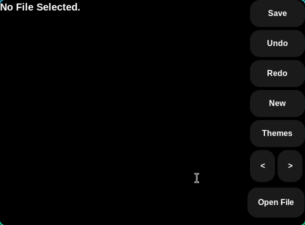

# VoidPad 🖤

VoidPad is a minimal yet powerful text editor built with Python and Tkinter&CustomTkinter. Designed for simplicity, speed, and customization, VoidPad makes coding or note-taking a breeze.

## Features ✨
- Lightweight and fast ⚡
- Clean, modern interface 🖤
- Open, edit, and save text files easily 📝
- Theme support for personalized experience 🎨
- Cross-platform (Windows, Linux, macOS) 🌍

## Showcase



## Dependencies 📦
Python 3.8+

Tkinter (usually included with Python)

CustomTkinter

Install via pip if needed:
```
pip install customtkinter
```
## Installation 💻
1. Clone the repo:  
```bash
git clone https://github.com/VxidDev/VoidPad.git
```
2. Navigate to the folder:
```
cd VoidPad
```
3. Run the app.
```
python app.py
```
### Usage 🖱️

Open files via the Open File button

Edit text directly in the editor

Save changes with the Save button

Switch themes with Themes button

### Roadmap 🚀

- DONE - v1.0.0 – Core editor with basic themes
- DONE - v1.1 - Functionality update
- DONE - v1.2 - GUI Update
- DONE - v1.3 - Theme Update
- Coming soon. - v1.4 - ???
- Coming soon. - v1.5 - ???

### Contributing 🤝

Pull requests are welcome! Feel free to submit issues or improvements.
Make sure to follow the code style and test features before submitting.

### License 📄

MIT LICENSE
